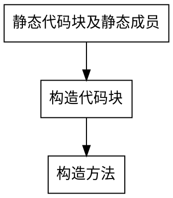
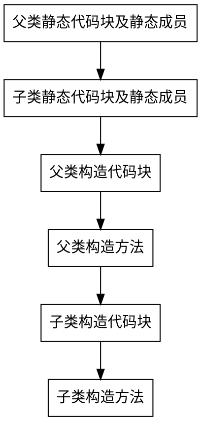

# Java基础知识点总结
## 数据类型
### 基本数据类型
|数据类型|byte（字节）|bit（比特）|
|:----:|:----:|:----:|
|byte|1|8|
|char|2|16|
|short|2|16|
|int|4|32|
|float|4|32|
|long|8|64|
|double|8|64|
|boolean|~|~|

PS：boolean 只有两个值：true、false，可以使用 1 bit 来存储，但是具体大小没有明确规定。JVM 会在编译时期将 boolean 类型的数据转换为 int，使用 1 来表示 true，0 表示 false。JVM 支持 boolean 数组，但是是通过读写 byte 数组来实现的。

### 数据类型转换之隐式转换
- 当小的类型和大的类型进行混合运算的时候，会把小的数据类型提升为大的数据类型。

### 数据类型转换之强制转换
- 从大类型到小类型，需要强制转换符实现强制转换。

PS：不参与运算时整数可以直接赋值给byte、short、char，参与运算时需要强制转换。
```
short s1 = 4;
short s2 = 4;
short s3 = (short) (s1 + s2);

char ch1 = 1;
char ch2 = 4;
char ch3 = (char) (ch1 + ch2);

byte b1 = 127;
byte b2 = 10;
byte b3 = (byte) (b1 + b2);
```

### 包装数据类型
|包装数据类型|所对应的基本数据类型|
|:----:|:----:|
|Byte|byte|
|Character|char|
|Short|short|
|Integer|int|
|Float|float|
|Long|long|
|Double|double|
|Boolean|boolean|

PS：在JDK1.5版本之后，引入了自动装箱和自动拆箱
- 自动装箱：基本类型自动转为包装类
- 自动拆箱：包装类转为基本类型

### 缓冲池（常量池）

面试题
```
Integer a1 = 127;
Integer b1 = 127;
System.out.println(a1 == b1);   //true

Integer a2 = 128;
Integer b2 = 128;
System.out.println(a2 == b2);   //false

解释：JVM会自动维护基本类型的常量池，int常量池中初始化-128~127的范围，所以当为Integer i=127时，在自动装箱过程中是取自常量池中的数值，而当Integer i=128时，128不在常量池范围内，所以在自动装箱过程中需new 128，所以地址不一样。
```

基本类型对应的缓冲池如下：

- boolean values true and false
- all byte values
- short values between -128 and 127
- int values between -128 and 127
- char in the range \u0000 to \u007F

在使用这些基本类型对应的包装类型时，如果该数值范围在缓冲池范围内，就可以直接使用缓冲池中的对象。

在 jdk 1.8 所有的数值类缓冲池中，Integer 的缓冲池 IntegerCache 很特殊，这个缓冲池的下界是 - 128，上界默认是 127，但是这个上界是可调的，在启动 jvm 的时候，通过 -XX:AutoBoxCacheMax=<size> 来指定这个缓冲池的大小，该选项在 JVM 初始化的时候会设定一个名为 java.lang.IntegerCache.high 系统属性，然后 IntegerCache 初始化的时候就会读取该系统属性来决定上界。

## ASCII码表
- ASCII第一次以规范标准的类型发表是在1967年，最后一次更新则是在1986年，到目前为止共定义了`128个字符`

- 必须记住的三个值
    - '0' 48
    - 'A' 65
    - 'a' 97


## 修饰符
### 访问修饰符（权限修饰符）
Java中，可以使用访问控制符来保护对类、变量、方法和构造方法的访问。

- 4种权限修饰符访问范围表

|修饰符名称|同一个类|同一个包|不同包的子类|不同包的非子类|
|:----:|:----:|:----:|:----:|:----:|
|private|√||||
|default|√|√|||
|protected|√|√|√||
|public|√|√|√|√|

### 非访问修饰符
1、static 修饰符，用来修饰类方法和类变量。

2、final 修饰符，用来修饰类、方法和变量，final 修饰的类不能够被继承，修饰的方法不能被继承类重新定义，修饰的变量为常量，是不可修改的。

3、abstract 修饰符，用来创建抽象类和抽象方法。

4、transient 修饰符，序列化的对象包含被 transient 修饰的实例变量时，java 虚拟机(JVM)跳过该特定的变量。该修饰符包含在定义变量的语句中，用来预处理类和变量的数据类型。

```
public transient int limit = 55;   // 不会持久化
public int b; // 持久化
```

5、synchronized 修饰符，该关键字声明的方法同一时间只能被一个线程访问。synchronized 修饰符可以应用于四个访问修饰符。

6、volatile 修饰符，volatile 修饰的成员变量在每次被线程访问时，都强制从共享内存中重新读取该成员变量的值。而且，当成员变量发生变化时，会强制线程将变化值回写到共享内存。这样在任何时刻，两个不同的线程总是看到某个成员变量的同一个值。

一个 volatile 对象引用可能是 null。

```
public class ConcurrentTest {

    //不加volatile关键字会导致死锁
    //private static boolean running = true;
    private static volatile boolean running = true;

    public static class AnotherThread extends Thread {
        @Override
        public void run() {
            System.out.println("AnotherThread is running");
            while (running) {}
            System.out.println("AnotherThread is stoped");
        }
    }

    public static void main(String[] args) throws Exception {
        new AnotherThread().start();
        Thread.sleep(1000);

        // 1 秒之后想停止 AnotherThread
        running = false;  
    }
}
```

## 接口和抽象类的区别
- 接口&抽象类对比表

|参数|抽象类|接口|
|:----:|:----:|:----:|
|构造器|可以有|不能有|
|继承|单继承多实现|可以多继承|
|属性|可以有|只能是不可变常量|
|方法|既可以声明方法也可以实现方法|只能做方法申明
|使用|关注事物的本质|关注操作

## 代码块详解
### 代码块的分类及概念
- 静态代码块：在类中方法外出现，加了static修饰；用于给类进行初始化，在加载的时候就执行，并且只执行一次。 
- 构造代码块（初始化代码块）：在类中方法外出现；多个构造方法方法中相同的代码存放到一起，每次调用构造都执行，并且在构造方法执行前执行。

### 初始化顺序
- 普通类初始化


- 继承体系初始化


## String
> 引用自：[cyc2018](https://cyc2018.github.io/CS-Notes/#/notes/Java%20%E5%9F%BA%E7%A1%80?id=%e4%ba%8c%e3%80%81string)
### 概述

String 被声明为 `final`，因此它不可被继承。(Integer 等包装类也不能被继承）

在 Java 8 中，String 内部使用 char 数组存储数据。

```
public final class String implements java.io.Serializable, Comparable<String>, CharSequence {
    /** The value is used for character storage. */
    private final char value[];
}
```

在 Java 9 之后，String 类的实现改用 `byte` 数组存储字符串，同时使用 `coder` 来标识使用了哪种编码。

```
public final class String implements java.io.Serializable, Comparable<String>, CharSequence {
    /** The value is used for character storage. */
    private final byte[] value;

    /** The identifier of the encoding used to encode the bytes in {@code value}. */
    private final byte coder;
}
```

value 数组被声明为 final，这意味着 value 数组初始化之后就不能再引用其它数组。并且 String 内部没有改变 value 数组的方法，因此可以保证 String 不可变。

### 不可变的好处
1、可以缓存 hash 值

因为 String 的 hash 值经常被使用，例如 String 用做 HashMap 的 key。不可变的特性可以使得 hash 值也不可变，因此只需要进行一次计算。

2、String Pool 的需要

如果一个 String 对象已经被创建过了，那么就会从 String Pool 中取得引用。只有 String 是不可变的，才可能使用 String Pool。


3、安全性

String 经常作为参数，String 不可变性可以保证参数不可变。例如在作为网络连接参数的情况下如果 String 是可变的，那么在网络连接过程中，String 被改变，改变 String 的那一方以为现在连接的是其它主机，而实际情况却不一定是。

4、线程安全

String 不可变性天生具备线程安全，可以在多个线程中安全地使用。

[Program Creek : Why String is immutable in Java?](https://www.programcreek.com/2013/04/why-string-is-immutable-in-java/)

### String, StringBuffer and StringBuilder比较

||可变性|线程安全|
|:----:|:----:|:----:|
|String|不可变|线程安全|
|StringBuffer|可变|线程安全，内部使用 synchronized 进行同步|
|StringBuilder|可变|非线程安全，但效率高|

[StackOverflow : String, StringBuffer, and StringBuilder](https://stackoverflow.com/questions/2971315/string-stringbuffer-and-stringbuilder)

### String Pool

字符串常量池（String Pool）保存着所有字符串字面量（literal strings），这些字面量在编译时期就确定。不仅如此，还可以使用 String 的 intern() 方法在运行过程将字符串添加到 String Pool 中。

当一个字符串调用 intern() 方法时，如果 String Pool 中已经存在一个字符串和该字符串值相等（使用 equals() 方法进行确定），那么就会返回 String Pool 中字符串的引用；否则，就会在 String Pool 中添加一个新的字符串，并返回这个新字符串的引用。

下面示例中，s1 和 s2 采用 new String() 的方式新建了两个不同字符串，而 s3 和 s4 是通过 s1.intern() 方法取得同一个字符串引用。intern() 首先把 s1 引用的字符串放到 String Pool 中，然后返回这个字符串引用。因此 s3 和 s4 引用的是同一个字符串。

```
String s1 = new String("aaa");
String s2 = new String("aaa");
System.out.println(s1 == s2);           // false
String s3 = s1.intern();
String s4 = s1.intern();
System.out.println(s3 == s4);           // true
```

如果是采用 "bbb" 这种字面量的形式创建字符串，会自动地将字符串放入 String Pool 中。

```
String s5 = "bbb";
String s6 = "bbb";
System.out.println(s5 == s6);  // true
```

在 Java 7 之前，String Pool 被放在运行时常量池中，它属于永久代。而在 Java 7，String Pool 被移到堆中。这是因为永久代的空间有限，在大量使用字符串的场景下会导致 OutOfMemoryError 错误。

[StackOverflow : What is String interning?](https://stackoverflow.com/questions/10578984/what-is-string-interning)

[深入解析 String#intern](https://tech.meituan.com/in_depth_understanding_string_intern.html)

### new String("abc")

使用这种方式一共会创建两个字符串对象（前提是 String Pool 中还没有 "abc" 字符串对象）。

- "abc" 属于字符串字面量，因此编译时期会在 String Pool 中创建一个字符串对象，指向这个 "abc" 字符串字面量；
- 而使用 new 的方式会在堆中创建一个字符串对象。
创建一个测试类，其 main 方法中使用这种方式来创建字符串对象。

```
public class NewStringTest {
    public static void main(String[] args) {
        String s = new String("abc");
    }
}
```

使用 javap -verbose 进行反编译，得到以下内容：

```
// ...
Constant pool:
// ...
   #2 = Class              #18            // java/lang/String
   #3 = String             #19            // abc
// ...
  #18 = Utf8               java/lang/String
  #19 = Utf8               abc
// ...

  public static void main(java.lang.String[]);
    descriptor: ([Ljava/lang/String;)V
    flags: ACC_PUBLIC, ACC_STATIC
    Code:
      stack=3, locals=2, args_size=1
         0: new           #2                  // class java/lang/String
         3: dup
         4: ldc           #3                  // String abc
         6: invokespecial #4                  // Method java/lang/String."<init>":(Ljava/lang/String;)V
         9: astore_1
// ...
```

在 Constant Pool 中，#19 存储这字符串字面量 "abc"，#3 是 String Pool 的字符串对象，它指向 #19 这个字符串字面量。在 main 方法中，0: 行使用 new #2 在堆中创建一个字符串对象，并且使用 ldc #3 将 String Pool 中的字符串对象作为 String 构造函数的参数。

以下是 String 构造函数的源码，可以看到，在将一个字符串对象作为另一个字符串对象的构造函数参数时，并不会完全复制 value 数组内容，而是都会指向同一个 value 数组。

```
public String(String original) {
    this.value = original.value;
    this.hash = original.hash;
}
```

## Object 通用方法
> 引用自：[cyc2018](https://cyc2018.github.io/CS-Notes/#/notes/Java%20%E5%9F%BA%E7%A1%80?id=%e4%ba%94%e3%80%81object-%e9%80%9a%e7%94%a8%e6%96%b9%e6%b3%95)

### 概述
所有类都直接或者间接的继承自该类

```
public native int hashCode()

public boolean equals(Object obj)

protected native Object clone() throws CloneNotSupportedException

public String toString()

public final native Class<?> getClass()

protected void finalize() throws Throwable {}

public final native void notify()

public final native void notifyAll()

public final native void wait(long timeout) throws InterruptedException

public final void wait(long timeout, int nanos) throws InterruptedException

public final void wait() throws InterruptedException
```

### equals()
1、等价关系

两个对象具有等价关系，需要满足以下五个条件：

Ⅰ 自反性
```
a.equals(a); // true
```

Ⅱ 对称性
```
a.equals(b) == b.equals(a); // true
```

Ⅲ 传递性
```
if (a.equals(b) && b.equals(c)) {
    a.equals(c); // true;
}
```

Ⅳ 一致性

多次调用 equals() 方法结果不变
```
a.equals(b) == b.equals(a); // true
```

Ⅴ 与 null 的比较

对任何不是 null 的对象 x 调用 x.equals(null) 结果都为 false
```
a.equals(null); // false;
```

2、等价与相等
- 对于基本类型，== 判断两个值是否相等，基本类型没有 equals() 方法。
- 对于引用类型，== 判断两个变量是否引用同一个对象，而 equals() 判断引用的对象是否等价。

```
Integer x = new Integer(1);
Integer y = new Integer(1);
System.out.println(x.equals(y)); // true
System.out.println(x == y);      // false
```

3、实现
- 检查是否为同一个对象的引用，如果是直接返回 true；
- 检查是否是同一个类型，如果不是，直接返回 false；
- 将 Object 对象进行转型；
- 判断每个关键域是否相等。

```
public class EqualExample {

    private int x;
    private int y;
    private int z;

    public EqualExample(int x, int y, int z) {
        this.x = x;
        this.y = y;
        this.z = z;
    }

    @Override
    public boolean equals(Object o) {
        if (this == o) return true;
        if (o == null || getClass() != o.getClass()) return false;

        EqualExample that = (EqualExample) o;

        if (x != that.x) return false;
        if (y != that.y) return false;
        return z == that.z;
    }
}
```

### hashCode()
hashCode() 返回哈希值，而 equals() 是用来判断两个对象是否等价。等价的两个对象散列值一定相同，但是散列值相同的两个对象不一定等价，这是因为计算哈希值具有随机性，两个值不同的对象可能计算出相同的哈希值。

在覆盖 equals() 方法时应当总是覆盖 hashCode() 方法，保证等价的两个对象哈希值也相等。

HashSet 和 HashMap 等集合类使用了 hashCode() 方法来计算对象应该存储的位置，因此要将对象添加到这些集合类中，需要让对应的类实现 hashCode() 方法。

下面的代码中，新建了两个等价的对象，并将它们添加到 HashSet 中。我们希望将这两个对象当成一样的，只在集合中添加一个对象。但是 EqualExample 没有实现 hashCode() 方法，因此这两个对象的哈希值是不同的，最终导致集合添加了两个等价的对象。

```
EqualExample e1 = new EqualExample(1, 1, 1);
EqualExample e2 = new EqualExample(1, 1, 1);
System.out.println(e1.equals(e2)); // true
HashSet<EqualExample> set = new HashSet<>();
set.add(e1);
set.add(e2);
System.out.println(set.size());   // 2
```

理想的哈希函数应当具有均匀性，即不相等的对象应当均匀分布到所有可能的哈希值上。这就要求了哈希函数要把所有域的值都考虑进来。可以将每个域都当成 R 进制的某一位，然后组成一个 R 进制的整数。

R 一般取 31，因为它是一个奇素数，如果是偶数的话，当出现乘法溢出，信息就会丢失，因为与 2 相乘相当于向左移一位，最左边的位丢失。并且一个数与 31 相乘可以转换成移位和减法：`31*x == (x<<5)-x`，编译器会自动进行这个优化。

```
@Override
public int hashCode() {
    int result = 17;
    result = 31 * result + x;
    result = 31 * result + y;
    result = 31 * result + z;
    return result;
}
```

### toString()
默认返回 ToStringExample@4554617c 这种形式，其中 @ 后面的数值为散列码的无符号十六进制表示。

```
public class ToStringExample {

    private int number;

    public ToStringExample(int number) {
        this.number = number;
    }
}
```
```
ToStringExample example = new ToStringExample(123);
System.out.println(example.toString());
```
```
ToStringExample@4554617c
```

### clone()
1、cloneable

clone() 是 Object 的 protected 方法，它不是 public，一个类不显式去重写 clone()，其它类就不能直接去调用该类实例的 clone() 方法。

```
public class CloneExample {
    private int a;
    private int b;
}
```
```
CloneExample e1 = new CloneExample();
// CloneExample e2 = e1.clone(); // 'clone()' has protected access in 'java.lang.Object'
```
重写 clone() 得到以下实现：
```
public class CloneExample {
    private int a;
    private int b;

    @Override
    public CloneExample clone() throws CloneNotSupportedException {
        return (CloneExample)super.clone();
    }
}
```
```
CloneExample e1 = new CloneExample();
try {
    CloneExample e2 = e1.clone();
} catch (CloneNotSupportedException e) {
    e.printStackTrace();
}
```
```
java.lang.CloneNotSupportedException: CloneExample
```

以上抛出了 CloneNotSupportedException，这是因为 CloneExample 没有实现 Cloneable 接口。

应该注意的是，clone() 方法并不是 Cloneable 接口的方法，而是 Object 的一个 protected 方法。Cloneable 接口只是规定，如果一个类没有实现 Cloneable 接口又调用了 clone() 方法，就会抛出 CloneNotSupportedException。

```
public class CloneExample implements Cloneable {
    private int a;
    private int b;

    @Override
    public Object clone() throws CloneNotSupportedException {
        return super.clone();
    }
}
```

2、浅拷贝

拷贝对象和原始对象的引用类型引用同一个对象。
```
public class ShallowCloneExample implements Cloneable {

    private int[] arr;

    public ShallowCloneExample() {
        arr = new int[10];
        for (int i = 0; i < arr.length; i++) {
            arr[i] = i;
        }
    }

    public void set(int index, int value) {
        arr[index] = value;
    }

    public int get(int index) {
        return arr[index];
    }

    @Override
    protected ShallowCloneExample clone() throws CloneNotSupportedException {
        return (ShallowCloneExample) super.clone();
    }
}
```
```
ShallowCloneExample e1 = new ShallowCloneExample();
ShallowCloneExample e2 = null;
try {
    e2 = e1.clone();
} catch (CloneNotSupportedException e) {
    e.printStackTrace();
}
e1.set(2, 222);
System.out.println(e2.get(2)); // 222
```
3、深拷贝

拷贝对象和原始对象的引用类型引用不同对象。
```
public class DeepCloneExample implements Cloneable {

    private int[] arr;

    public DeepCloneExample() {
        arr = new int[10];
        for (int i = 0; i < arr.length; i++) {
            arr[i] = i;
        }
    }

    public void set(int index, int value) {
        arr[index] = value;
    }

    public int get(int index) {
        return arr[index];
    }

    @Override
    protected DeepCloneExample clone() throws CloneNotSupportedException {
        DeepCloneExample result = (DeepCloneExample) super.clone();
        result.arr = new int[arr.length];
        for (int i = 0; i < arr.length; i++) {
            result.arr[i] = arr[i];
        }
        return result;
    }
}
```
```
DeepCloneExample e1 = new DeepCloneExample();
DeepCloneExample e2 = null;
try {
    e2 = e1.clone();
} catch (CloneNotSupportedException e) {
    e.printStackTrace();
}
e1.set(2, 222);
System.out.println(e2.get(2)); // 2
```
4、clone() 的替代方案

使用 clone() 方法来拷贝一个对象即复杂又有风险，它会抛出异常，并且还需要类型转换。Effective Java 书上讲到，最好不要去使用 clone()，可以使用拷贝构造函数或者拷贝工厂来拷贝一个对象。
```
public class CloneConstructorExample {

    private int[] arr;

    public CloneConstructorExample() {
        arr = new int[10];
        for (int i = 0; i < arr.length; i++) {
            arr[i] = i;
        }
    }

    public CloneConstructorExample(CloneConstructorExample original) {
        arr = new int[original.arr.length];
        for (int i = 0; i < original.arr.length; i++) {
            arr[i] = original.arr[i];
        }
    }

    public void set(int index, int value) {
        arr[index] = value;
    }

    public int get(int index) {
        return arr[index];
    }
}
```
```
CloneConstructorExample e1 = new CloneConstructorExample();
CloneConstructorExample e2 = new CloneConstructorExample(e1);
e1.set(2, 222);
System.out.println(e2.get(2)); // 2
```
## 反射
### 类加载概述和加载时机
1、类加载概述

当程序在第一次使用某个类的时候，如果该类还未被加载到内存中，则系统会通过加载，连接，初始化三步来实现对这个类进行初始化。

Ⅰ加载：就是将 class 文件动态加载到JVM中，并为之创建一个 class 对象。任何类被使用时系统都会建立一个class对象。

Ⅱ 连接：
- 验证：是否有正确的内部结构，并且与其他类协调一致。
- 准备：负责为类的静态成员分配内存，并设置默认初始化值。
- 解析：将类的二进制数据中的符号引用替换为直接引用。

Ⅲ 初始化：参考下面说明。
```
Student s = new Student();

1、Student.class加载进内存

2、声明一个Student类型引用s

3、在堆内存创建对象

4、给对象中属性默认初始化值

5、属性进行显示初始化

6、构造方法进栈，对对象中的属性赋值，构造方法弹栈

7、将对象的地址值赋值给s
```

### 反射概述
1、什么是反射

JAVA反射机制是在运行状态中，对任意一个类，都能知道这个类的所有属性和方法；对任意一个对象，都能调用它的任意一个方法和属性；这种动态获取信息的方法以及动态调用对象的方法和功能称为JAVA语言的反射机制。

2、实现反射的三种方式
- Object类的getClass()方法，判断两个对象是否是同一个字节码文件。
- 静态属性class，锁对象。
- Class类中的静态方法forName()，读取配置文件。

```
public class Person {

    public String name;     //故意设置为public
    private Integer age;

    public String getName() {
        return name;
    }

    public void setName(String name) {
        this.name = name;
    }

    public Person() {
    }

    public Person(String name, Integer age) {
        this.name = name;
        this.age = age;
    }

    @Override
    public String toString() {
        return "Person{" +
                "name='" + name + '\'' +
                ", age=" + age +
                '}';
    }

    public void watch() {
        System.out.println("watch...");
    }

    public void speak(String content) {
        System.out.println("speak: " + content);
    }
}
```
```
public class ReflectTest {

    public static void main(String[] args) throws ClassNotFoundException {
        Class clazz1 = new Person().getClass();
        Class clazz2 = Person.class;
        Class clazz3 = Class.forName("com.intflag.bean.Person");

        System.out.println(clazz1 == clazz2);   //true
        System.out.println(clazz2 == clazz3);   //true
    }
}
```
3、反射进阶操作

`java.lang.Class` 和 `java.lang.reflect` 一起对反射提供了支持，`java.lang.reflect` 类库主要包含了以下三个类：

- Field ：可以使用 `get()` 和 `set()` 方法读取和修改 Field 对象关联的字段；
- Method ：可以使用 `invoke()` 方法调用与 Method 对象关联的方法；
- Constructor ：可以用 Constructor 的 `newInstance()` 创建新的对象。

> 以下示例为了减少篇幅，不捕获异常，采用抛出的方式

Ⅰ 通过反射获取带参构造方法并使用
```
@Test
public void constructorTest() throws Exception {
    Class clazz = Class.forName("com.intflag.bean.Person");
    Constructor constructor = clazz.getConstructor(String.class, Integer.class);
    Object obj = constructor.newInstance("tom", 18);
    if (obj instanceof Person) {
        Person person = (Person) obj;
        System.out.println(person);     //Person{name='tom', age=18}
    }
}
```
Ⅱ 通过反射获取成员变量并使用
```
@Test
public void fieldTest() throws Exception {
    Class clazz = Class.forName("com.intflag.bean.Person");
    Constructor constructor = clazz.getConstructor(String.class, Integer.class);
    Person person = (Person) constructor.newInstance("tom", 18);
    System.out.println(person);     //Person{name='tom', age=18}

    Field name = clazz.getField("name");
    name.set(person, "jerry");
    System.out.println(person);     //Person{name='jerry', age=18}

    //Field age = clazz.getField("age");              //执行报错：java.lang.NoSuchFieldException: age 因为getField方法只能获取公有属性
    Field age = clazz.getDeclaredField("age");       //暴力反射获取字段
    age.setAccessible(true);        //去除age属性的私有权限，否则将报错：java.lang.IllegalAccessException: Class basics.ReflectTest can not access a member of class com.intflag.bean.Person with modifiers "private"
    age.set(person, 20);            //Person{name='jerry', age=20}
    System.out.println(person);
}
```
Ⅲ 通过反射获取成员方法并使用
```
@Test
public void methodTest() throws Exception {
    Class clazz = Class.forName("com.intflag.bean.Person");
    Constructor constructor = clazz.getConstructor(String.class, Integer.class);
    Person person = (Person) constructor.newInstance("tom", 18);
    System.out.println(person);                 //Person{name='tom', age=18}

    Method watch = clazz.getMethod("watch");    //获取无参watch方法
    watch.invoke(person);                       //watch...

    Method speak = clazz.getMethod("speak", String.class);  //获取有参speak方法
    speak.invoke(person, "I Love You");                     //speak: I Love You
}
```
