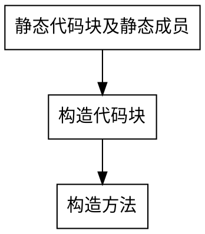
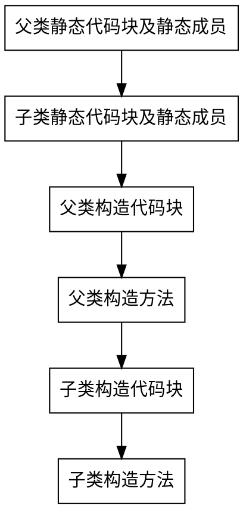

# Java基础知识点总结
## 数据类型
### 基本数据类型
|数据类型|byte（字节）|bit（比特）|
|:----:|:----:|:----:|
|byte|1|8|
|char|2|16|
|short|2|16|
|int|4|32|
|float|4|32|
|long|8|64|
|double|8|64|
|boolean|~|~|

PS：boolean 只有两个值：true、false，可以使用 1 bit 来存储，但是具体大小没有明确规定。JVM 会在编译时期将 boolean 类型的数据转换为 int，使用 1 来表示 true，0 表示 false。JVM 支持 boolean 数组，但是是通过读写 byte 数组来实现的。

### 数据类型转换之隐式转换
- 当小的类型和大的类型进行混合运算的时候，会把小的数据类型提升为大的数据类型。

### 数据类型转换之强制转换
- 从大类型到小类型，需要强制转换符实现强制转换。

PS：不参与运算时整数可以直接赋值给byte、short、char，参与运算时需要强制转换。
```
short s1 = 4;
short s2 = 4;
short s3 = (short) (s1 + s2);

char ch1 = 1;
char ch2 = 4;
char ch3 = (char) (ch1 + ch2);

byte b1 = 127;
byte b2 = 10;
byte b3 = (byte) (b1 + b2);
```

### 包装数据类型
|包装数据类型|所对应的基本数据类型|
|:----:|:----:|
|Byte|byte|
|Character|char|
|Short|short|
|Integer|int|
|Float|float|
|Long|long|
|Double|double|
|Boolean|boolean|

PS：在JDK1.5版本之后，引入了自动装箱和自动拆箱
- 自动装箱：基本类型自动转为包装类
- 自动拆箱：包装类转为基本类型

### 缓冲池（常量池）

面试题
```
Integer a1 = 127;
Integer b1 = 127;
System.out.println(a1 == b1);   //true

Integer a2 = 128;
Integer b2 = 128;
System.out.println(a2 == b2);   //false

解释：JVM会自动维护基本类型的常量池，int常量池中初始化-128~127的范围，所以当为Integer i=127时，在自动装箱过程中是取自常量池中的数值，而当Integer i=128时，128不在常量池范围内，所以在自动装箱过程中需new 128，所以地址不一样。
```

基本类型对应的缓冲池如下：

- boolean values true and false
- all byte values
- short values between -128 and 127
- int values between -128 and 127
- char in the range \u0000 to \u007F

在使用这些基本类型对应的包装类型时，如果该数值范围在缓冲池范围内，就可以直接使用缓冲池中的对象。

在 jdk 1.8 所有的数值类缓冲池中，Integer 的缓冲池 IntegerCache 很特殊，这个缓冲池的下界是 - 128，上界默认是 127，但是这个上界是可调的，在启动 jvm 的时候，通过 -XX:AutoBoxCacheMax=<size> 来指定这个缓冲池的大小，该选项在 JVM 初始化的时候会设定一个名为 java.lang.IntegerCache.high 系统属性，然后 IntegerCache 初始化的时候就会读取该系统属性来决定上界。

## ASCII码表
- ASCII第一次以规范标准的类型发表是在1967年，最后一次更新则是在1986年，到目前为止共定义了`128个字符`

- 必须记住的三个值
    - '0' 48
    - 'A' 65
    - 'a' 97


## 权限修饰符访问范围
- 4种权限修饰符访问范围表

|修饰符名称|同一个类|同一个包|不同包的子类|不同包的非子类|
|:----:|:----:|:----:|:----:|:----:|
|private|√||||
|default|√|√|||
|protected|√|√|√||
|public|√|√|√|√|

## 接口和抽象类的区别
- 接口&抽象类对比表

|参数|抽象类|接口|
|:----:|:----:|:----:|
|构造器|可以有|不能有|
|继承|单继承多实现|可以多继承|
|属性|可以有|只能是不可变常量|
|方法|既可以声明方法也可以实现方法|只能做方法申明
|使用|关注事物的本质|关注操作

## 代码块详解
### 代码块的分类及概念
- 静态代码块：在类中方法外出现，加了static修饰；用于给类进行初始化，在加载的时候就执行，并且只执行一次。 
- 构造代码块（初始化代码块）：在类中方法外出现；多个构造方法方法中相同的代码存放到一起，每次调用构造都执行，并且在构造方法执行前执行。

### 初始化顺序
- 普通类初始化


- 继承体系初始化


## String
> 引用自：[cyc2018](https://cyc2018.github.io/CS-Notes/#/notes/Java%20%E5%9F%BA%E7%A1%80?id=%e4%ba%8c%e3%80%81string)
### 概述

String 被声明为 `final`，因此它不可被继承。(Integer 等包装类也不能被继承）

在 Java 8 中，String 内部使用 char 数组存储数据。

```
public final class String implements java.io.Serializable, Comparable<String>, CharSequence {
    /** The value is used for character storage. */
    private final char value[];
}
```

在 Java 9 之后，String 类的实现改用 `byte` 数组存储字符串，同时使用 `coder` 来标识使用了哪种编码。

```
public final class String implements java.io.Serializable, Comparable<String>, CharSequence {
    /** The value is used for character storage. */
    private final byte[] value;

    /** The identifier of the encoding used to encode the bytes in {@code value}. */
    private final byte coder;
}
```

value 数组被声明为 final，这意味着 value 数组初始化之后就不能再引用其它数组。并且 String 内部没有改变 value 数组的方法，因此可以保证 String 不可变。

### 不可变的好处
1、可以缓存 hash 值

因为 String 的 hash 值经常被使用，例如 String 用做 HashMap 的 key。不可变的特性可以使得 hash 值也不可变，因此只需要进行一次计算。

2、String Pool 的需要

如果一个 String 对象已经被创建过了，那么就会从 String Pool 中取得引用。只有 String 是不可变的，才可能使用 String Pool。


3、安全性

String 经常作为参数，String 不可变性可以保证参数不可变。例如在作为网络连接参数的情况下如果 String 是可变的，那么在网络连接过程中，String 被改变，改变 String 的那一方以为现在连接的是其它主机，而实际情况却不一定是。

4、线程安全

String 不可变性天生具备线程安全，可以在多个线程中安全地使用。

[Program Creek : Why String is immutable in Java?](https://www.programcreek.com/2013/04/why-string-is-immutable-in-java/)

### String, StringBuffer and StringBuilder比较

||可变性|线程安全|
|:----:|:----:|:----:|
|String|不可变|线程安全|
|StringBuffer|可变|线程安全，内部使用 synchronized 进行同步|
|StringBuilder|可变|非线程安全，但效率高|

[StackOverflow : String, StringBuffer, and StringBuilder](https://stackoverflow.com/questions/2971315/string-stringbuffer-and-stringbuilder)

### String Pool

字符串常量池（String Pool）保存着所有字符串字面量（literal strings），这些字面量在编译时期就确定。不仅如此，还可以使用 String 的 intern() 方法在运行过程将字符串添加到 String Pool 中。

当一个字符串调用 intern() 方法时，如果 String Pool 中已经存在一个字符串和该字符串值相等（使用 equals() 方法进行确定），那么就会返回 String Pool 中字符串的引用；否则，就会在 String Pool 中添加一个新的字符串，并返回这个新字符串的引用。

下面示例中，s1 和 s2 采用 new String() 的方式新建了两个不同字符串，而 s3 和 s4 是通过 s1.intern() 方法取得同一个字符串引用。intern() 首先把 s1 引用的字符串放到 String Pool 中，然后返回这个字符串引用。因此 s3 和 s4 引用的是同一个字符串。

```
String s1 = new String("aaa");
String s2 = new String("aaa");
System.out.println(s1 == s2);           // false
String s3 = s1.intern();
String s4 = s1.intern();
System.out.println(s3 == s4);           // true
```

如果是采用 "bbb" 这种字面量的形式创建字符串，会自动地将字符串放入 String Pool 中。

```
String s5 = "bbb";
String s6 = "bbb";
System.out.println(s5 == s6);  // true
```

在 Java 7 之前，String Pool 被放在运行时常量池中，它属于永久代。而在 Java 7，String Pool 被移到堆中。这是因为永久代的空间有限，在大量使用字符串的场景下会导致 OutOfMemoryError 错误。

[StackOverflow : What is String interning?](https://stackoverflow.com/questions/10578984/what-is-string-interning)

[深入解析 String#intern](https://tech.meituan.com/in_depth_understanding_string_intern.html)

### new String("abc")

使用这种方式一共会创建两个字符串对象（前提是 String Pool 中还没有 "abc" 字符串对象）。

- "abc" 属于字符串字面量，因此编译时期会在 String Pool 中创建一个字符串对象，指向这个 "abc" 字符串字面量；
- 而使用 new 的方式会在堆中创建一个字符串对象。
创建一个测试类，其 main 方法中使用这种方式来创建字符串对象。

```
public class NewStringTest {
    public static void main(String[] args) {
        String s = new String("abc");
    }
}
```

使用 javap -verbose 进行反编译，得到以下内容：

```
// ...
Constant pool:
// ...
   #2 = Class              #18            // java/lang/String
   #3 = String             #19            // abc
// ...
  #18 = Utf8               java/lang/String
  #19 = Utf8               abc
// ...

  public static void main(java.lang.String[]);
    descriptor: ([Ljava/lang/String;)V
    flags: ACC_PUBLIC, ACC_STATIC
    Code:
      stack=3, locals=2, args_size=1
         0: new           #2                  // class java/lang/String
         3: dup
         4: ldc           #3                  // String abc
         6: invokespecial #4                  // Method java/lang/String."<init>":(Ljava/lang/String;)V
         9: astore_1
// ...
```

在 Constant Pool 中，#19 存储这字符串字面量 "abc"，#3 是 String Pool 的字符串对象，它指向 #19 这个字符串字面量。在 main 方法中，0: 行使用 new #2 在堆中创建一个字符串对象，并且使用 ldc #3 将 String Pool 中的字符串对象作为 String 构造函数的参数。

以下是 String 构造函数的源码，可以看到，在将一个字符串对象作为另一个字符串对象的构造函数参数时，并不会完全复制 value 数组内容，而是都会指向同一个 value 数组。

```
public String(String original) {
    this.value = original.value;
    this.hash = original.hash;
}
```