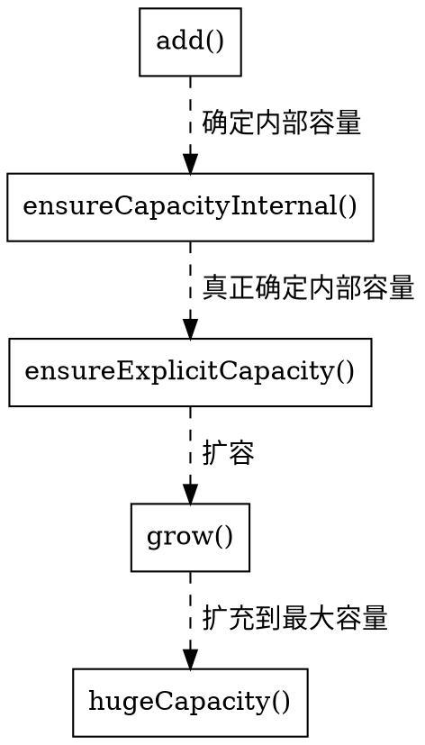

> 本章节涉及到的源码为 JDK 1.8
# 集合框架体系


## ArrayList
### 继承体系图

### 成员变量
- `private static final int DEFAULT_CAPACITY = 10`：默认初始化容量，长度为10。
- `private static final Object[] EMPTY_ELEMENTDATA = {}`：用于空实例的共享空数组。
- `private static final Object[] DEFAULTCAPACITY_EMPTY_ELEMENTDATA = {}`：用于默认大小的空实例的共享空数组。
- `transient Object[] elementData`：存储ArrayList元素的数组缓冲区。
由于ArrayList是基于动态数组实现的，所以并不是所有的空间都被使用。因此使用了`transient`修饰，可以防止被自动序列化。
所以ArrayList自定义了序列化与反序列化的实现，只序列化了被使用的数据。
- `private int size`：ArrayList元素个数。

### 构造方法
- `public ArrayList()`：空参构造。
- `public ArrayList(int initialCapacity)`：实例化时指定大小。
- `public ArrayList(Collection<? extends E> c)`：通过一个集合实例化，会将集合中的元素转成数组赋值给elementData。

### 核心方法
- `public boolean add(E e)`：添加元素到列表末尾。

其中`grow()`方法是ArrayList能够动态扩容的核心方法，正常情况下会扩容1.5倍，特殊情况下（新扩展数组大小已经达到了最大值）则只取最大值。
```java
private void grow(int minCapacity) {
    // overflow-conscious code
    int oldCapacity = elementData.length;
    // 将大小扩容值原始大小的1.5倍
    int newCapacity = oldCapacity + (oldCapacity >> 1);
    if (newCapacity - minCapacity < 0)
        newCapacity = minCapacity;
    // 特殊情况下，如果数据大小已经达到最大值，会扩充到最大值
    if (newCapacity - MAX_ARRAY_SIZE > 0)
        newCapacity = hugeCapacity(minCapacity);
    // 对数据进行拷贝
    // minCapacity is usually close to size, so this is a win:
    elementData = Arrays.copyOf(elementData, newCapacity);
}
```
通过分析源码我们得知，ArrayList在进行扩容时需要对数据进行拷贝，所以平时在使用的时候最好手动指定大小，尽量减少扩容操作。
- `public E remove(int index)`：删除指定位置上的元素。首先会对索引进行校验，然后找到要删除的元素，计算需要移动的位数，接着对数据进行移动，然后将最后一个元素的位置赋值为null，让虚拟机的垃圾回收机制更快的回收它。
```java
public E remove(int index) {
    rangeCheck(index);

    modCount++;
    E oldValue = elementData(index);

    int numMoved = size - index - 1;
    if (numMoved > 0)
        System.arraycopy(elementData, index+1, elementData, index,
                            numMoved);
    elementData[--size] = null; // clear to let GC do its work

    return oldValue;
}
```
- `public int indexOf(Object o)`：返回指定元素在列表中的索引。首先会对要查找的元素进行判空，因为ArrayList是可以存储null的，所以依然会for循环进行查找，但是只会返回首次为null的索引，如果要查找的元素不为null，通过for循环用equals进行比较，如果列表中无该元素会返回-1。
```java
public int indexOf(Object o) {
    if (o == null) {
        for (int i = 0; i < size; i++)
            if (elementData[i]==null)
                return i;
    } else {
        for (int i = 0; i < size; i++)
            if (o.equals(elementData[i]))
                return i;
    }
    return -1;
}
```
## LinkedList
### 继承体系图

### 数据结构

> 在JDK1.8中，LinkedList底层是基于双向链表实现的。

### 成员变量
- `transient int size = 0`：列表长度，默认为0。
- `transient Node<E> first`：指向头结点的指针。
- `transient Node<E> last`：指向尾结点的指针。

### 构造方法
- `public LinkedList()`：空参构造，内部没有任何实现。
- `public LinkedList(Collection<? extends E> c)`：通过集合实例化，内部调用了`addAll`方法实现。

### 核心方法
- `public boolean add(E e)`：添加元素到列表末尾。
```java
public boolean add(E e) {
    linkLast(e);
    return true;
}
void linkLast(E e) {
    final Node<E> l = last;
    final Node<E> newNode = new Node<>(l, e, null);
    last = newNode;
    if (l == null)
        first = newNode;
    else
        l.next = newNode;
    size++;
    modCount++;
}
```
由源码可知，在新增元素的时候首先会定义一个变量保存尾指针，然后新建一个节点将元素保存，并且将尾指针指向新节点，但如果尾指针为`null`的话会将头指针指向新节点，否则将之前保存的上一个节点的后继指针指向新节点，这样新节点就被链起来了。
- `public E get(int index)`：获取指定位置上的元素。
```java
public E get(int index) {
    checkElementIndex(index);
    return node(index).item;
}
Node<E> node(int index) {
    // assert isElementIndex(index);

    if (index < (size >> 1)) {
        Node<E> x = first;
        for (int i = 0; i < index; i++)
            x = x.next;
        return x;
    } else {
        Node<E> x = last;
        for (int i = size - 1; i > index; i--)
            x = x.prev;
        return x;
    }
}
```
通过分析源码可以得知，首先对索引进行校验，然后调用了`Node<E> node(int index)`方法，该方法的功能是返回索引位置的节点，基本原理很简单，就是将`index`与列表的一半`size >> 1`进行比较，如果靠前，就从头指针开始向右移动，反之，则从尾指针开始向左移动，利用双向链表的这一特性，LinkedList获取节点的时间复杂度就是`O(n/2)`。
- `public E remove(int index)`：删除指定位置上的元素。
```java
    public E remove(int index) {
        checkElementIndex(index);
        return unlink(node(index));
    }
    E unlink(Node<E> x) {
        // assert x != null;
        final E element = x.item;
        final Node<E> next = x.next;
        final Node<E> prev = x.prev;

        if (prev == null) {
            first = next;
        } else {
            prev.next = next;
            x.prev = null;
        }

        if (next == null) {
            last = prev;
        } else {
            next.prev = prev;
            x.next = null;
        }

        x.item = null;
        size--;
        modCount++;
        return element;
    }
```
由源码可知，删除一个节点主要是调用了`E unlink(Node<E> x)`，从方法的名字也能明白，本质上就是断开了要删除节点和前后节点之间的引用。可以参考下面这个示意图。<br>


## HashMap
### 继承体系图

### 数据结构
> 在jdk1.7中，HashMap采用数组+链表(拉链法)。因为数组是一组连续的内存空间，易查询，不易增删，而链表是不连续的内存空间，通过节点相互连接，易删除，不易查询。HashMap结合这两者的优秀之处来提高效率。<br><br>而在jdk1.8时，为了解决当hash碰撞过于频繁，而链表的查询效率(时间复杂度为O(n))过低时，当链表的长度达到一定值(默认是8)时，将链表转换成红黑树(时间复杂度为O(lg n))，极大的提高了查询效率。

 

### 成员变量
- `static final int DEFAULT_INITIAL_CAPACITY = 1 << 4`：默认初始容量，默认为16。
- `static final int MAXIMUM_CAPACITY = 1 << 30`：最大容量，为2的30次方。
- `static final float DEFAULT_LOAD_FACTOR = 0.75f`：默认负载因子，默认为0.75。
- `static final int TREEIFY_THRESHOLD = 8`：将链表转换为红黑树的阈值。
- `static final int UNTREEIFY_THRESHOLD = 6`：将红黑树转换回链表的阈值。
- `static final int MIN_TREEIFY_CAPACITY = 64`：。

### 构造方法
- `public HashMap()`：空参构造。
- `public HashMap(int initialCapacity)`：通过一个指定的容量实例化。
- `public HashMap(int initialCapacity, float loadFactor)`：通过一个指定的容量和负载因子实例化。
- `public HashMap(Map<? extends K, ? extends V> m)`：通过一个map集合实例化，内部通过循环遍历将数据存储到新的map中。
### 核心方法
- `static final int hash(Object key)`：计算key的哈希值。
```java
static final int hash(Object key) {
    int h;
    return (key == null) ? 0 : (h = key.hashCode()) ^ (h >>> 16);
}
```
计算示意图：
 
<br>源码中没有直接采用经过`hashCode`方法处理的哈希码作为存储数组table的下标位置是为了解决计算出来的哈希码可能不在数组大小范围内，从而导致无法匹配存储位置问题（哈希码 &（数组长度-1）巧妙的解决）；
<br><br>为什么在计算数组下标前，需对哈希码进行二次处理：扰动处理？主要是为了加大哈希码低位的随机性，使得分布更均匀，从而提高对应数组存储下标位置的随机性和均匀性，最终减少Hash冲突。
<br><br>这个方法非常巧妙，它通过`h & (table.length -1)`来得到该对象的保存位，而HashMap底层数组的长度总是2的n次方，这是HashMap在速度上的优化。当length总是2的n次方时，`h& (length-1)`运算等价于`对length取模`，也就是`h%length`，但是`&比%具有更高的效率`。
  
- `public V put(K key, V value)`：新增键值对。
```java
public V put(K key, V value) {
    return putVal(hash(key), key, value, false, true);
}
final V putVal(int hash, K key, V value, boolean onlyIfAbsent,
                boolean evict) {
    Node<K,V>[] tab; Node<K,V> p; int n, i;
    if ((tab = table) == null || (n = tab.length) == 0)
        n = (tab = resize()).length;
    if ((p = tab[i = (n - 1) & hash]) == null)
        tab[i] = newNode(hash, key, value, null);
    else {
        Node<K,V> e; K k;
        if (p.hash == hash &&
            ((k = p.key) == key || (key != null && key.equals(k))))
            e = p;
        else if (p instanceof TreeNode)
            e = ((TreeNode<K,V>)p).putTreeVal(this, tab, hash, key, value);
        else {
            for (int binCount = 0; ; ++binCount) {
                if ((e = p.next) == null) {
                    p.next = newNode(hash, key, value, null);
                    if (binCount >= TREEIFY_THRESHOLD - 1) // -1 for 1st
                        treeifyBin(tab, hash);
                    break;
                }
                if (e.hash == hash &&
                    ((k = e.key) == key || (key != null && key.equals(k))))
                    break;
                p = e;
            }
        }
        if (e != null) { // existing mapping for key
            V oldValue = e.value;
            if (!onlyIfAbsent || oldValue == null)
                e.value = value;
            afterNodeAccess(e);
            return oldValue;
        }
    }
    ++modCount;
    if (++size > threshold)
        resize();
    afterNodeInsertion(evict);
    return null;
}
```

## TreeMap
### 继承体系图

### 成员变量
### 构造方法
### 核心方法

## HashSet
### 继承体系图

### 构造方法
### 核心方法

## TreeSet
### 继承体系图

### 成员变量
### 构造方法
### 核心方法
