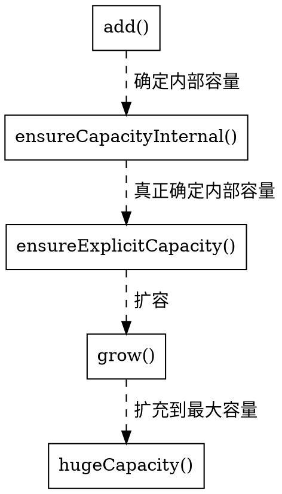

> 本章节涉及到的源码为 JDK 1.8
# 集合框架体系


## ArrayList
### 继承体系图

### 成员变量
- `DEFAULT_CAPACITY`：默认初始化容量，长度为10。
- `EMPTY_ELEMENTDATA`：用于空实例的共享空数组。
- `DEFAULTCAPACITY_EMPTY_ELEMENTDATA`：用于默认大小的空实例的共享空数组。
- `elementData`：存储ArrayList元素的数组缓冲区。
由于ArrayList是基于动态数组实现的，所以并不是所有的空间都被使用。因此使用了`transient`修饰，可以防止被自动序列化。
所以ArrayList自定义了序列化与反序列化的实现，只序列化了被使用的数据。
- `size`：ArrayList元素个数。

### 构造方法
- `public ArrayList()`：空参构造。
- `public ArrayList(int initialCapacity)`：实例化时指定大小。
- `public ArrayList(Collection<? extends E> c)`：通过一个集合实例化，会将集合中的元素转成数组赋值给elementData。

### 核心方法
- `public boolean add(E e)`：添加元素到列表末尾。

其中`grow()`方法是ArrayList能够动态扩容的核心方法，正常情况下会扩容1.5倍，特殊情况下（新扩展数组大小已经达到了最大值）则只取最大值。
```java
private void grow(int minCapacity) {
    // overflow-conscious code
    int oldCapacity = elementData.length;
    // 将大小扩容值原始大小的1.5倍
    int newCapacity = oldCapacity + (oldCapacity >> 1);
    if (newCapacity - minCapacity < 0)
        newCapacity = minCapacity;
    // 特殊情况下，如果数据大小已经达到最大值，会扩充到最大值
    if (newCapacity - MAX_ARRAY_SIZE > 0)
        newCapacity = hugeCapacity(minCapacity);
    // 对数据进行拷贝
    // minCapacity is usually close to size, so this is a win:
    elementData = Arrays.copyOf(elementData, newCapacity);
}
```
通过分析源码我们得知，ArrayList在进行扩容时需要对数据进行拷贝，所以平时在使用的时候最好手动指定大小，尽量减少扩容操作。
- `public E remove(int index)`：在指定位置删除元素。首先会对索引进行校验，然后找到要删除的元素，计算需要移动的位数，接着对数据进行移动，然后将最后一个元素的位置赋值为null，让虚拟机的垃圾回收机制更快的回收它。
```java
public E remove(int index) {
    rangeCheck(index);

    modCount++;
    E oldValue = elementData(index);

    int numMoved = size - index - 1;
    if (numMoved > 0)
        System.arraycopy(elementData, index+1, elementData, index,
                            numMoved);
    elementData[--size] = null; // clear to let GC do its work

    return oldValue;
}
```
- `public int indexOf(Object o)`：返回指定元素在列表中的索引。首先会对要查找的元素进行判空，因为ArrayList是可以存储null的，所以依然会for循环进行查找，但是只会返回首次为null的索引，如果要查找的元素不为null，通过for循环用equals进行比较，如果列表中无该元素会返回-1。
```java
public int indexOf(Object o) {
    if (o == null) {
        for (int i = 0; i < size; i++)
            if (elementData[i]==null)
                return i;
    } else {
        for (int i = 0; i < size; i++)
            if (o.equals(elementData[i]))
                return i;
    }
    return -1;
}
```
## LinkedList
### 继承体系图

### 成员变量
### 构造方法
### 核心方法

## HashSet
### 继承体系图

### 成员变量
### 构造方法
### 核心方法

## TreeSet
### 继承体系图

### 成员变量
### 构造方法
### 核心方法

## HashMap
### 继承体系图

### 成员变量
### 构造方法
### 核心方法

## TreeMap
### 继承体系图

### 成员变量
### 构造方法
### 核心方法