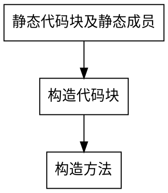
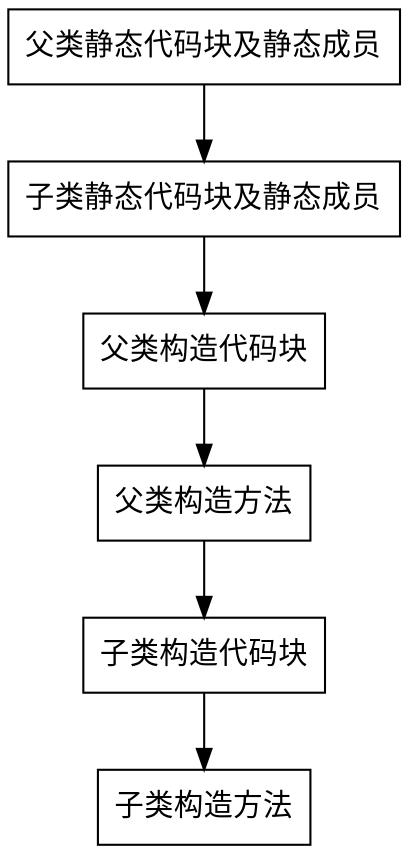

# 笔试易错知识点总结
## 权限修饰符访问范围
- 4种权限修饰符访问范围表

||同一个类|同一个包|不同包的子类|不同包的非子类|
|:----:|:----:|:----:|:----:|:----:|
|private|√||||
|default|√|√|||
|protected|√|√|√||
|public|√|√|√|√|

## 接口和抽象类的区别
- 接口&抽象类对比表

|参数|抽象类|接口|
|:----:|:----:|:----:|
|构造器|可以有|不能有|
|继承|单继承多实现|可以多继承|
|属性|可以有|只能是不可变常量|
|方法|既可以声明方法也可以实现方法|只能做方法申明
|使用|关注事物的本质|关注操作

## 代码块详解
### 代码块的分类及概念
- 静态代码块：在类中方法外出现，加了static修饰；用于给类进行初始化，在加载的时候就执行，并且只执行一次。 
- 构造代码块（初始化代码块）：在类中方法外出现；多个构造方法方法中相同的代码存放到一起，每次调用构造都执行，并且在构造方法执行前执行。

### 初始化顺序
- 普通类初始化

- 继承体系初始化

